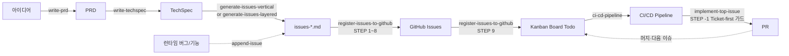
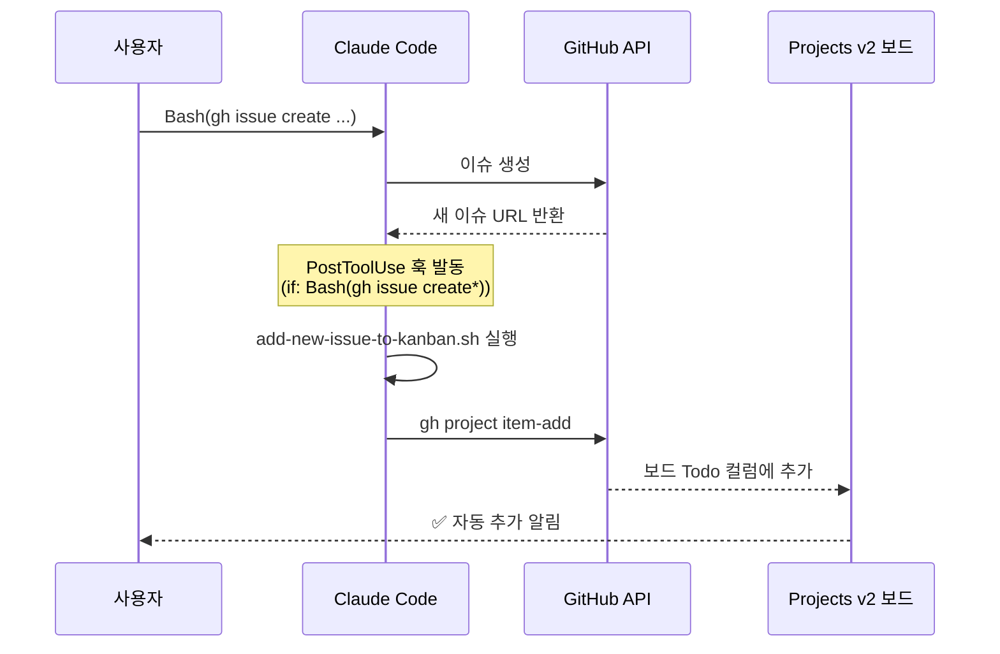

# SDLC Skill Pack for Claude Code

소프트웨어 개발 생명주기(SDLC) 전 단계를 자동화하는 **Claude Code 플러그인**입니다.
아이디어에서 출발해 PRD → TechSpec → 이슈 → GitHub 등록 → 칸반 → CI/CD → PR까지 한 번에.

> 8개의 스킬이 **서로 바통을 넘기도록** 설계되어 있어, 각 단계 산출물이 다음 스킬의 입력이 됩니다.

---

## 📦 저장소 구조

```
sdlc/
├── .claude-plugin/
│   ├── plugin.json          # Claude Code 공식 플러그인 매니페스트
│   └── marketplace.json     # /plugin marketplace add 용 정의
├── skills/                  # Claude Code가 자동 로드하는 스킬 루트
│   ├── write-prd/
│   ├── write-techspec/
│   ├── generate-issues-vertical/
│   ├── generate-issues-layered/
│   ├── register-issues-to-github/
│   ├── github-kanban-skill/
│   ├── ci-cd-pipeline/
│   └── implement-top-issue/
├── commands/                # 슬래시 커맨드 정의 (22개 · 스킬 호출 엔트리)
├── hooks/                   # Claude Code 라이프사이클 훅 (gh issue create → 칸반 자동 추가)
│   ├── hooks.json
│   └── add-new-issue-to-kanban.sh
├── references/              # PRD/TechSpec 템플릿, 이슈 분할 전략 비교 자료
├── install.sh               # bash 설치 스크립트 (대체 경로)
├── uninstall.sh
└── README.md
```

---

## 🛠 포함된 스킬 요약

| # | 스킬 | SDLC 단계 | 주요 산출물 |
|---|------|----------|-------------|
| 1 | `write-prd` | 기획 | `prd.md` |
| 2 | `write-techspec` | 설계 | `techspec.md` |
| 3 | `generate-issues-vertical` | 백로그 분할 (수직) | `issues-vertical.md` |
| 4 | `generate-issues-layered` | 백로그 분할 (계층) | `issues-layered.md` |
| 5 | `append-issue` | 런타임 이슈 추가 | 이슈 파일 append + GitHub + 보드 체인 반영 |
| 6 | `register-issues-to-github` | 이슈 등록 + 보드 반영 | GitHub Issues, 레이블, 칸반 Todo 배치 |
| 7 | `github-kanban-skill` | 프로젝트 관리 | GitHub Projects 보드 |
| 8 | `ci-cd-pipeline` | DevOps | `.github/workflows/*`, Dockerfile, PR |
| 9 | `implement-top-issue` | 구현 | 브랜치 · 코드 · 테스트 · PR (Ticket-first 가드) |

> 🎟 **이슈 우선(Ticket-first) 원칙**: 모든 코드 변경은 반드시 이슈 파일 →
> GitHub Issue → 칸반 보드 Todo 경로를 거친 뒤에만 구현될 수 있다.
> `implement-top-issue` 는 STEP -1 가드로 이 원칙을 **코드 레벨**에서 강제한다.
> 런타임에 새로 생긴 버그/기능은 `append-issue` 가 파일 append 부터 보드
> 반영까지 한 번에 처리해 준다.

---

## 🚀 설치

두 가지 방법 중 선택하세요. **`/plugin` 명령**(방법 1)이 가장 간편하고 권장 방식입니다.

> 📌 **최신 릴리스**: `v1.1.0` — `gh issue create` 후 이슈를 칸반 보드에 **자동 추가**하는 PostToolUse 훅 추가.
> 버전을 고정해서 설치하려면 **마켓플레이스 URL에 `#v1.1.0` 처럼 ref를 붙이세요** (아래 "특정 버전 설치" 참조).

### 방법 1 — Claude Code `/plugin` 명령 (권장)

#### ① 사용자 전역 설치 (모든 프로젝트에서 사용)

```text
/plugin marketplace add ischung/sdlc
/plugin install sdlc-skill-pack@sdlc-marketplace
```

#### ② 프로젝트 레벨 설치 (현재 프로젝트에만 적용)

`--scope project` 플래그로 지정합니다. `.claude/settings.json`에 기록되어 **git 커밋하면 팀원과 자동 공유**됩니다.

```text
/plugin marketplace add ischung/sdlc --scope project
/plugin install sdlc-skill-pack@sdlc-marketplace --scope project
```

개인 전용(팀과 공유 X)으로는 `--scope local`을 씁니다.

```text
/plugin install sdlc-skill-pack@sdlc-marketplace --scope local
```

#### ③ 대화형 UI (가장 쉬움)

```text
/plugin
```

→ **Discover** 탭 → 플러그인 선택 → `Enter` → scope(User / Project / Local) 선택

#### scope 비교

| scope | 적용 범위 | 기록 위치 | 팀 공유 |
|-------|----------|----------|:-------:|
| `user` (기본) | 모든 프로젝트 | `~/.claude/settings.json` | — |
| `project` | 현재 프로젝트만 | `.claude/settings.json` | ✅ (git 커밋 시) |
| `local` | 현재 프로젝트만 | `.claude/settings.local.json` | ❌ |

> 로컬 경로를 마켓플레이스로 등록할 수도 있습니다: `/plugin marketplace add /절대/경로/to/sdlc`
> 단일 플러그인 직접 설치: `/plugin install /절대/경로/to/sdlc`

#### ④ 특정 버전(태그) 고정 설치

`/plugin install` 자체에는 버전 옵션이 없지만, **마켓플레이스 URL에 `#<ref>`를 붙이면** 해당 태그/브랜치로 pin됩니다. 아래는 `v1.0.1`로 고정하는 예시입니다.

```text
/plugin marketplace add https://github.com/ischung/sdlc.git#v1.0.1
/plugin install sdlc-skill-pack@sdlc-marketplace
```

프로젝트 레벨 + 버전 pin:

```text
/plugin marketplace add https://github.com/ischung/sdlc.git#v1.0.1 --scope project
/plugin install sdlc-skill-pack@sdlc-marketplace --scope project
```

> 이미 마켓플레이스를 등록해 두었다면 먼저 제거 후 재등록합니다: `/plugin marketplace remove sdlc-marketplace` → 위 명령 재실행.
> 최신 버전으로 올라가려면 `#v...` 없이(=`main` 추적) 등록하거나, `#<새-태그>`로 재등록하세요.

### 방법 2 — bash 스크립트

Claude Code가 없거나 셸에서 직접 설치·제거하고 싶을 때 사용합니다.

```bash
# 최신 main 브랜치로 clone
git clone https://github.com/ischung/sdlc.git sdlc-skill-pack

# 특정 버전(태그)으로 clone
git clone --branch v1.0.1 https://github.com/ischung/sdlc.git sdlc-skill-pack

cd sdlc-skill-pack
chmod +x install.sh uninstall.sh

./install.sh                       # 대화형 선택
./install.sh --all                 # 프로젝트 레벨 전체
./install.sh --global --all        # 전역(~/.claude/skills/) 전체
./install.sh --skill write-prd     # 개별 설치
./install.sh --global --all --yes  # 확인 없이 자동 설치
```

이미 clone된 저장소에서 특정 버전으로 전환:

```bash
cd sdlc-skill-pack
git fetch --tags
git checkout v1.0.1
./install.sh --all --yes
```

bash 스크립트의 설치 위치:

| 범위 | 경로 | 적용 대상 |
|------|------|-----------|
| 프로젝트 | `.claude/skills/<skill-name>/` | 해당 프로젝트에서만 |
| 전역 | `~/.claude/skills/<skill-name>/` | 모든 프로젝트 |

> 설치 후 Claude Code를 재시작하거나 새 세션을 열면 스킬이 활성화됩니다.
> 공식 플러그인 문서: https://code.claude.com/docs/en/plugins

---

## 🗑 제거

설치할 때 사용한 scope와 같은 scope로 제거합니다.

```text
/plugin uninstall sdlc-skill-pack                   # user scope
/plugin uninstall sdlc-skill-pack --scope project   # project scope
/plugin uninstall sdlc-skill-pack --scope local     # local scope
```

bash 스크립트로 설치한 경우:

```bash
./uninstall.sh                    # 대화형
./uninstall.sh --all              # 프로젝트 레벨 전체
./uninstall.sh --global --all     # 전역 전체
./uninstall.sh --skill write-prd
./uninstall.sh --global --all --yes
```

---

## 🔄 SDLC 워크플로



각 단계의 출력은 다음 단계의 입력이 됩니다. 한 번에 하나씩, 승인 후 다음으로 넘어가는 **Incremental Validation** 패턴을 따릅니다. **런타임에 새로 생긴 이슈**는 `append-issue` 를 통해 다시 이 파이프라인의 맨 앞 단계(이슈 파일) 로 들어와 같은 경로로 흘러갑니다. 즉, 임시방편으로 코드만 고치고 이슈를 나중에 만드는 역방향 흐름을 허용하지 않습니다.

### 🎟 이슈 우선(Ticket-first) 원칙

```
           ❌ 금지 경로                              ✅ 올바른 경로

   사용자 요청 ──→ 바로 구현                  사용자 요청 ──→ /append-issue
   (이슈 없음)                                                    │
                                                                  ▼
                                                        이슈 파일에 블록 append
                                                                  │
                                                                  ▼
                                                        register-issues-to-github
                                                        (GitHub + 보드 반영)
                                                                  │
                                                                  ▼
                                                        /implement-top-issue
                                                        (STEP -1 가드 통과 후 구현)
```

교육적 의미: **추적성(Traceability)** 은 단순히 "기록하는 행위" 가 아니라 "기록을 강제하는 시스템" 이다. 학생이 스스로 원칙을 지키기를 기대하는 것보다, 원칙을 지키지 않으면 도구가 **거부**하게 만드는 편이 훨씬 견고하다. 이는 Clean Code 의 "Fail loudly" 와 DevOps 의 "Shift left" 원칙이 교차하는 지점이다.

---

## 📘 스킬 상세 사용법

각 스킬은 **자연어 트리거**(예: "PRD 만들어줘")나 **슬래시 커맨드**로 실행할 수 있습니다. 슬래시 커맨드는 플러그인 루트의 `commands/` 디렉토리에 등록되어 있어, 플러그인 설치 후 즉시 사용 가능합니다.

### 전체 슬래시 커맨드 목록

| 스킬 | 커맨드 |
|------|--------|
| `write-prd` | `/write-prd` |
| `write-techspec` | `/write-techspec` |
| `generate-issues-vertical` | `/generate-issues-vertical` · `/vertical-issues` |
| `generate-issues-layered` | `/generate-issues-layered` · `/layered-issues` |
| `append-issue` | `/append-issue` · `/add-issue` · `/new-issue` |
| `register-issues-to-github` | `/register-issues-to-github` · `/push-issues` · `/register-issues` |
| `github-kanban-skill` | `/kanban-create` · `/kanban-add-issues` · `/kanban-status` · `/kanban-from-final-issues` · `/kanban-sync` · `/kanban-teardown` |
| `ci-cd-pipeline` | `/ci-cd-pipeline` · `/run-ci-cd` · `/implement-cicd-issue` |
| `implement-top-issue` | `/implement-top-issue` · `/implement-priority-issue` · `/pickup-issue` · `/work-next-issue` |

> 커맨드는 단순 별칭이 아니라 **Skill 도구를 호출하도록 작성된 프롬프트 엔트리**입니다. 인자를 받는 커맨드는 `argument-hint` 로 표시해두었으니 Claude Code UI에서 자동완성으로 확인할 수 있습니다.

---

### 1️⃣ `write-prd` — PRD 작성

**역할**: 시니어 PM 코치 역할로 아이디어를 PRD(Product Requirements Document)로 다듬습니다. Phase 0(아이디어 청취) → Phase 8(최종 저장)까지 8단계로 진행.

**설계 원칙**: One at a time · Multiple choice first · YAGNI · Explore alternatives · Incremental validation

**슬래시 커맨드**

| 커맨드 | 설명 |
|--------|------|
| `/write-prd` | PRD 작성 세션 시작 |

**트리거 예시**
```
PRD 만들어줘
제품 기획서 써줘
요구사항 문서 작성해줘
```

**산출물**: 프로젝트 루트에 `prd.md`

---

### 2️⃣ `write-techspec` — TechSpec 작성

**역할**: PRD를 분석해 **TechSpec(Technical Specification)** 을 섹션별 승인 루프로 작성합니다.

**다루는 섹션**: 아키텍처 패턴 · 기술 스택 · 데이터 모델 · API 명세 · 기능 명세 · UI 가이드 · 마일스톤

**슬래시 커맨드**

| 커맨드 | 설명 |
|--------|------|
| `/write-techspec` | PRD → TechSpec 작성 |

**트리거 예시**
```
techspec 작성해줘
PRD로 기술 명세서 만들어줘
```

**전제조건**: `prd.md` 존재
**산출물**: `techspec.md`

---

### 3️⃣ `generate-issues-vertical` — 수직 슬라이스 이슈 생성

**역할**: TechSpec을 **Walking Skeleton + Vertical Slice + CI/CD-first** 전략으로 분할. 기능 이슈 전에 CI 부트스트랩 → CD 스테이징을 먼저 배치하여 "초록불 파이프라인 위에서 굴러가는" 상태를 가장 빨리 만듭니다.

**특징**
- 각 슬라이스는 UI + API + DB + 테스트 + 배포를 End-to-End 포함
- INVEST 6요건 충족
- 모든 이슈에 `**Depends on**: #N` 의존성 + 위상 정렬 실행 순서 자동 생성

**슬래시 커맨드**

| 커맨드 | 설명 |
|--------|------|
| `/generate-issues-vertical` | 수직 분할 이슈 파일 생성 |
| `/vertical-issues` | 축약 별칭 |

**트리거 예시**
```
수직 슬라이스로 이슈 만들어줘
Walking Skeleton 방식 이슈
MVP 단위로 티켓 쪼개줘
```

**전제조건**: `techspec.md` 존재
**산출물**: `issues-vertical.md` *(GitHub 등록은 별도 스킬)*

---

### 4️⃣ `generate-issues-layered` — 계층별 이슈 생성

**역할**: TechSpec을 **아키텍처 계층(Layer) 순서 + CI/CD-first** 전략으로 분할. `Layer 0 (CI) → Layer 2 (CD 스켈레톤) → Layer 3 (DB) → … → Layer 9 (Prod 배포)` 순서로 이슈를 만듭니다.

**3️⃣ vs 4️⃣ 선택 가이드**

| 상황 | 추천 |
|------|------|
| 빠른 MVP · 사용자에게 보여줄 게 먼저 | **vertical** |
| 팀이 레이어별로 나뉘어 있고 역할이 고정 | **layered** |
| 교육/학습 목적으로 시스템 전체 구조 이해 | **layered** |

> 📄 자세한 비교는 `references/issue-splitting-comparison.md` 참고

**슬래시 커맨드**

| 커맨드 | 설명 |
|--------|------|
| `/generate-issues-layered` | 계층별 이슈 파일 생성 |
| `/layered-issues` | 축약 별칭 |

**트리거 예시**
```
계층별로 이슈 쪼개줘
DB→Backend→Frontend 순서로
레이어별 분할
```

**전제조건**: `techspec.md` 존재
**산출물**: `issues-layered.md`

---

### 5️⃣ `append-issue` — 런타임 이슈 추가 (Ticket-first 엔트리)

**역할**: 프로젝트 진행 **도중** 새로 생긴 버그·기능·운영 이슈를 기존 이슈 파일에 표준 블록 형식으로 append 하고, 곧바로 `register-issues-to-github` (STEP 9 보드 반영 포함) 까지 체인 실행합니다.

**왜 필요한가**: `generate-issues-*` 는 초기 기획용 **일괄 생성** 스킬입니다. 개발 도중 QA 에서 버그가 나오거나 이해관계자가 새 기능을 요청했을 때 같은 경로로 기록하려면 "append 전용 입구" 가 필요합니다. 이 입구가 없으면 학생들은 슬그머니 이슈 없이 코드를 고치기 시작합니다.

**핵심 기능**
- 대화형으로 유형·제목·설명·AC·의존성·우선순위 수집
- 파일 내 최대 `#[N]` 을 찾아 **N+1 로 자동 순번 부여**
- **표준 블록 템플릿** 강제 (파서 하위 호환성 보장)
- append 전 **자동 백업** (`<파일>.append-backup-<타임스탬프>.md`)
- 기본 동작은 **append → GitHub 등록 → 보드 반영** 체인 실행
- `--skip-register` / `--dry-run` 지원

**슬래시 커맨드**

| 커맨드 | 설명 |
|--------|------|
| `/append-issue` | 대화형 이슈 추가 + 전체 체인 실행 |
| `/add-issue` · `/new-issue` | 축약 별칭 |

**트리거 예시**
```
로그인 버그 이슈 추가해줘
CSV 내보내기 기능 이슈 만들어줘
이 오류 먼저 이슈로 등록하고 나중에 고칠게
```

**전제조건**: 기존 이슈 파일이 하나 이상 존재(없으면 `generate-issues-*` 먼저 실행)
**산출물**: 이슈 파일 새 블록 + GitHub Issue + 보드 Todo 카드

---

### 6️⃣ `register-issues-to-github` — 이슈 파일 → GitHub → 칸반 보드

**역할**: 로컬 이슈 마크다운 파일(`issues-vertical.md` / `issues-layered.md` / `cicd-issues.md` / `final-issues.md` 등)을 읽어 GitHub 저장소에 일괄 등록하고, **이어서 Projects v2 칸반 보드의 Todo 컬럼까지 한 번에 반영** 합니다 (STEP 9).

**핵심 기능**
- 제목·본문 파싱해 **레이블 자동 결정**
- 저장소에 없는 레이블은 **표준 색상 팔레트로 자동 생성**
- **중복 등록 방지** (기존 이슈 제목·메타 라인 대조)
- `Depends on #N` 임시 번호를 **실제 이슈 번호로 치환**
- 등록 성공 시 원본 파일에 `**GitHub Issue**: #N` in-place 추가
- **STEP 9: 칸반 보드 Todo 반영** (opt-in A/B/C/D; A=order 보존 배치, B=단순 추가)
- Dry-run 지원

**슬래시 커맨드**

| 커맨드 | 설명 |
|--------|------|
| `/register-issues-to-github` | 지정한 이슈 파일 → GitHub → 보드 (풀 체인) |
| `/push-issues` / `/register-issues` | 축약 별칭 |

**트리거 예시**
```
issues-vertical.md GitHub에 올려줘
이슈 파일 등록해줘
```

**전제조건**
- `issues-*.md` 파일 존재
- `gh auth login` 또는 `KANBAN_TOKEN` 환경변수 설정

---

### 7️⃣ `github-kanban-skill` — GitHub Projects 칸반 보드

**역할**: `gh` CLI + GraphQL로 **GitHub Projects(v2) 칸반 보드**를 자동 생성·구성하고 이슈를 우선순위대로 Todo 컬럼에 배치합니다.

**기본 구성**
- 컬럼: `Todo` / `In Progress` / `Review` / `Done`
- 선택적 커스텀 필드: `Priority` / `Size` / `Sprint`
- `order:NNN`, `mandatory-gate`, `profile:staging/prod` 레이블 인식
- 파괴적 작업(보드 삭제 등) 전에 **opt-in(A/B/C/D)** 확인

**슬래시 커맨드**

| 커맨드 | 설명 |
|--------|------|
| `/kanban-create` | 새 프로젝트 보드 생성 |
| `/kanban-add-issues` | 이슈를 Todo에 일괄 등록 |
| `/kanban-from-final-issues` | `final-issues.md` 기반 정렬 배치 |
| `/kanban-status` | 현재 보드 상태 요약 |
| `/kanban-sync` | 이슈 상태 ↔ 보드 컬럼 동기화 |
| `/kanban-teardown` | 보드 삭제 (확인 필수) |

**트리거 예시**
```
칸반 보드 만들어줘
GitHub 프로젝트 생성
티켓 보드 설정
```

**토큰 설정 규칙 (필독)**
- PAT 시크릿 이름은 **`KANBAN_TOKEN`** 으로 고정
- 필요 스코프: `repo`, `project`, `read:org`, `read:discussion`
- CI/CD·헤드리스 환경에서는 `KANBAN_TOKEN` 환경변수로 주입

---

### 8️⃣ `ci-cd-pipeline` — CI/CD 파이프라인 구현

**역할**: `[CI]`/`[CD]`/`[Security]`/`[Infra]` 카테고리 이슈를 받아 **실제 워크플로 파일과 배포 파이프라인을 작성하고, 로컬 검증 → PR → 머지 → 실제 실행까지 완결**합니다.

**산출물**
- `.github/workflows/*.yml` · `.github/CODEOWNERS`
- `Dockerfile*` · `fly.toml`/`render.yaml`/`vercel.json`
- `deploy/**/*.sh` · PR 보호 규칙 · README 상태 배지
- 스테이징/프로덕션 환경 실제 실행 결과

**검증 체인**: `yamllint → actionlint → shellcheck → act` + 시크릿 화이트리스트 가드 + `gh run watch --exit-status` + 스테이징 smoke 실패 시 자동 롤백

**슬래시 커맨드**

| 커맨드 | 설명 |
|--------|------|
| `/ci-cd-pipeline --issue N` | 이슈 #N을 CI/CD로 구현 |
| `/run-ci-cd --issue N` | 축약 별칭 |
| `/implement-cicd-issue N` | `implement-top-issue`가 내부 위임 시 사용 |
| `/ci-cd-pipeline --dry-run --issue N` | 계획만 출력 (STEP 8~10 스킵) |

**트리거 예시**
```
CI/CD 파이프라인 구축해줘
GitHub Actions 워크플로 작성
스테이징/프로덕션 배포 자동화
```

> `implement-top-issue`가 CI/CD 성격의 이슈를 감지하면 이 스킬로 자동 위임합니다 (하이브리드 모드).

---

### 9️⃣ `implement-top-issue` — 최우선 이슈 자동 구현 (Ticket-first 가드)

**역할**: GitHub Projects 보드에서 **가장 높은 우선순위의 이슈 1건**을 픽업하여 GitHub Flow에 따라 브랜치 생성 → 코드 구현(AC 기반) → 로컬 빌드/린트/테스트(단위·통합·E2E, UI는 Playwright) → PR 생성(`Closes #N`) → 보드 상태 전이까지 자동 수행합니다.

**핵심 약속**
- **한 번에 이슈 1건만** · 다중/병렬 금지
- **이슈를 새로 만들지 않음** · 보드가 비었으면 선행 스킬 안내
- **Ticket-first 가드 (STEP -1)** · G1~G5 판정 규칙으로 파일 순번만으로의 구현·저장소 부재·보드 부재 이슈를 선제 차단 → `/append-issue` 실행 안내 후 종료
- **AC(Acceptance Criteria) 기반 구현** · AC 없으면 보강 요청
- **CI/CD 이슈는 `ci-cd-pipeline`에 위임** (하이브리드 모드)
- **결정론적 선택**: `(priority_score, board_index, issue_number)` 키로 1건 고정

**우선순위 캐스케이드**: Priority 커스텀 필드(P0~P3) → `priority:p0~p3` 레이블 → 보드 표시 순서 → 이슈 번호

**슬래시 커맨드**

| 커맨드 | 설명 |
|--------|------|
| `/implement-top-issue` | 최우선 이슈 풀 사이클 |
| `/implement-priority-issue` · `/pickup-issue` · `/work-next-issue` | 별칭 |

**트리거 예시**
```
다음 이슈 구현해줘
AI 개발자처럼 티켓 하나 끝내줘
최우선 이슈 작업해줘
```

---

## 🔔 자동화 훅 (v1.1.0+)

이 플러그인은 설치 시 **Claude Code `PostToolUse` 훅**을 함께 등록합니다.
`gh issue create` 로 이슈를 만들 때마다 **그 이슈가 자동으로 Projects v2 칸반 보드에 추가**됩니다 — 수동으로 `/kanban-add-issues` 를 실행할 필요가 없습니다.

### 동작 플로우



### 훅이 보드 정보를 찾는 우선순위

1. **`.sdlc/kanban.json`** (프로젝트 루트) — 권장, 팀 공유 가능
   ```json
   {
     "projectNumber": "7",
     "owner": "your-org-or-username"
   }
   ```
2. **환경변수** `KANBAN_PROJECT_NUMBER` + `KANBAN_OWNER` — 개인/CI 전용
3. 둘 다 없으면 — Claude에게 "보드를 먼저 만들라(`/kanban-create`)"고 안내

### 인증

- 로컬: `gh auth login` 세션 그대로 사용
- CI/헤드리스: `KANBAN_TOKEN` 환경변수가 있으면 자동으로 `GH_TOKEN` 으로 export (`project` 스코프 필요)

### Fail-open 원칙

훅이 실패해도 `gh issue create` 자체의 성공은 보존됩니다. 훅은 **경고 메시지만 Claude에게 전달**하고 exit 0으로 종료합니다 — DevOps의 **"자동화는 방해가 되어선 안 된다"** 원칙을 따릅니다.

### 비활성화 방법

훅만 끄고 싶다면 사용자 `~/.claude/settings.json` 에 다음을 추가하세요.

```json
{ "disableAllHooks": true }
```

또는 플러그인 자체를 프로젝트 단위로 비활성화할 수 있습니다 (`/plugin` 메뉴).

---

## 🎯 엔드투엔드 예시 플로우

```text
1. /write-prd                                # 아이디어 → prd.md
2. /write-techspec                           # prd.md → techspec.md
3. /generate-issues-vertical                 # techspec.md → issues-vertical.md
4. /register-issues-to-github                # GitHub Issues 일괄 등록
5. /kanban-create                            # 칸반 보드 생성
6. /kanban-from-final-issues                 # 이슈를 Todo에 순서대로 배치
7. /implement-top-issue                      # 최우선 이슈 → PR (반복)
```

> `ci-cd-pipeline`은 보드 상 CI/CD 이슈에 도달했을 때 7번에서 자동 위임됩니다.
>
> **v1.1.0부터**: 스텝 4 이후 `gh issue create` 로 개별 이슈를 추가해도 자동으로 보드 Todo 컬럼에 들어갑니다.

---

## 📋 요구사항

- **Claude Code CLI**: https://claude.ai/code
- **GitHub CLI**: `gh` (이슈 등록 · 칸반 · CI/CD 스킬 필수)
- **PAT**: `KANBAN_TOKEN` (스코프: `repo`, `project`, `read:org`, `read:discussion`)
- **Shell**: bash 4+ 또는 zsh (bash 설치 스크립트 사용 시)
- **macOS / Linux**

---

## 🧑‍🏫 교육적 설계 원칙

이 플러그인은 소프트웨어 공학 교육 맥락에서 다음을 중시합니다.

- **Separation of Concerns** — 각 스킬은 SDLC 한 단계만 담당, 단일 책임
- **Incremental Validation** — 단계별 산출물을 검토한 뒤 다음 단계로 진행
- **CI/CD-first** — 기능 이슈 전에 파이프라인을 먼저 세워 "초록불 위에서" 개발
- **Convention over Configuration** — Claude Code 공식 규약(`skills/` 자동 로드)을 준수
- **GitHub Flow** — 짧은 브랜치 + PR 리뷰 + 머지, 자동화 친화적

---

## 📂 참고 자료

`references/` 폴더에 다음 템플릿과 분석 자료가 포함되어 있습니다.

| 파일 | 용도 |
|------|------|
| `prd-template.md` | PRD 작성 시 구조 참조 |
| `techspec-template.md` | TechSpec 섹션 구성 참조 |
| `issue-splitting-comparison.md` | vertical vs layered 전략 비교 |
| `issue-splitting-comparison.pdf` | 동일 내용 PDF 버전 |
| `frontend-design.md` | 프론트엔드 설계 가이드 |

---

## 📜 라이선스

MIT
