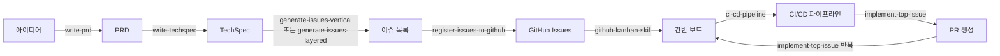

# SDLC Skill Pack for Claude Code

소프트웨어 개발 생명주기(SDLC) 전 단계를 자동화하는 **Claude Code 플러그인**입니다.
PRD 작성 → TechSpec → 이슈 생성 → GitHub 등록 → 칸반 보드 → CI/CD → 구현까지 한 번에.

---

## 📦 패키지 구조

```
sdlc/
├── .claude-plugin/
│   ├── plugin.json          # 공식 플러그인 매니페스트
│   └── marketplace.json     # 마켓플레이스 배포용 정의
├── skills/                  # Claude Code가 자동 로드하는 스킬 루트
│   ├── write-prd/
│   ├── write-techspec/
│   ├── generate-issues-vertical/
│   ├── generate-issues-layered/
│   ├── register-issues-to-github/
│   ├── github-kanban-skill/
│   ├── ci-cd-pipeline/
│   └── implement-top-issue/
├── install.sh               # 대체 설치 스크립트 (bash)
├── uninstall.sh             # 대체 제거 스크립트 (bash)
└── README.md
```

---

## 🛠 포함된 스킬

| 스킬 | 역할 |
|------|------|
| `write-prd` | 시니어 PM 코치 역할로 PRD 단계별 작성 |
| `write-techspec` | PRD → TechSpec (아키텍처, API 명세, 데이터 모델) |
| `generate-issues-vertical` | Vertical Slice 전략으로 이슈 분할 |
| `generate-issues-layered` | 계층별(Layer) 전략으로 이슈 분할 |
| `register-issues-to-github` | 로컬 마크다운 → GitHub 이슈 일괄 등록 |
| `github-kanban-skill` | GitHub Projects 칸반 보드 자동 생성·관리 |
| `ci-cd-pipeline` | GitHub Actions CI/CD 파이프라인 구현 |
| `implement-top-issue` | 최우선 이슈 자동 구현 → PR 생성 |

---

## 🚀 설치 방법

세 가지 방법 중 선택하면 됩니다. **방법 1(공식 `/plugin` 명령)** 을 권장합니다.

### 방법 1 — Claude Code 플러그인 마켓플레이스 (권장)

Claude Code 세션 안에서 슬래시 커맨드로 설치합니다.

```text
# 1) 로컬 경로를 마켓플레이스로 등록
/plugin marketplace add /절대/경로/to/sdlc

# 2) 플러그인 설치
/plugin install sdlc-skill-pack@sdlc-marketplace
```

원격(GitHub) 저장소라면:

```text
/plugin marketplace add <owner>/<repo>
/plugin install sdlc-skill-pack@sdlc-marketplace
```

### 방법 2 — Claude Code 단일 플러그인 설치

```text
/plugin install /절대/경로/to/sdlc
```

### 방법 3 — bash 스크립트 (셸에서 직접)

```bash
git clone <repo-url> sdlc-skill-pack
cd sdlc-skill-pack
chmod +x install.sh uninstall.sh

# 대화형 설치
./install.sh

# 모든 스킬 — 프로젝트 레벨
./install.sh --all

# 모든 스킬 — 전역 (~/.claude/skills/)
./install.sh --global --all

# 특정 스킬만
./install.sh --skill write-prd

# 확인 없이 자동 설치
./install.sh --global --all --yes
```

#### 설치 위치 비교

| 범위 | 경로 | 적용 대상 |
|------|------|-----------|
| 프로젝트 | `.claude/skills/<skill-name>/` | 해당 프로젝트에서만 |
| 전역 | `~/.claude/skills/<skill-name>/` | 모든 프로젝트 |

> 설치 후 Claude Code를 재시작하거나 새 세션을 열면 스킬이 활성화됩니다.

---

## 🗑 제거 방법

### 방법 1 — `/plugin`

```text
/plugin uninstall sdlc-skill-pack
```

### 방법 2 — bash 스크립트

```bash
./uninstall.sh              # 대화형
./uninstall.sh --all        # 프로젝트 레벨 전체
./uninstall.sh --global --all
./uninstall.sh --skill write-prd
./uninstall.sh --global --all --yes
```

---

## 📋 요구사항

- macOS / Linux (bash 4+ 또는 zsh) — bash 스크립트 방식을 쓸 경우
- [Claude Code CLI](https://claude.ai/code)

---

## 🔄 SDLC 워크플로우



---

## 🧑‍🏫 교육적 설계 원칙

이 플러그인은 소프트웨어 공학 교육 맥락에서 다음을 중시합니다:

- **Separation of Concerns** — 각 스킬은 SDLC 한 단계만 담당
- **Convention over Configuration** — Claude Code 공식 규약(`skills/` 자동 로드)을 그대로 따름
- **Incremental Validation** — 단계별 산출물을 검토한 뒤 다음 단계로 진행
- **CI/CD-first** — 기능 이슈 전에 파이프라인을 먼저 세워 "초록불 위에서 굴러가게"

---

## 📜 라이선스

MIT
