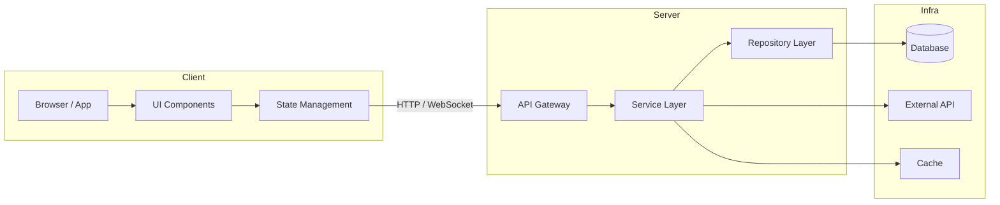

# Tech Spec: [기능/프로젝트명]

---

## 1. 문서 정보

| 항목 | 내용 |
|------|------|
| **작성일** | 2026-03-08 |
| **상태** | Draft |
| **버전** | v0.1 |
| **작성자** | [이름] |
| **검토자** | [이름] |
| **원문 PRD** | [PRD 문서 제목 및 링크 또는 경로] |
| **관련 이슈** | [GitHub Issue # 또는 Jira 티켓 링크] |

> **상태 정의**
> - `Draft`: 초안 작성 중 — 리뷰 전
> - `In Review`: 팀 리뷰 진행 중
> - `Approved`: 구현 착수 가능
> - `Implemented`: 구현 완료, 문서 동결

---

## 2. 시스템 아키텍처

### 2-1. 아키텍처 패턴

> **선택한 패턴**: [예: Client-Server / Layered / Event-Driven / Hexagonal / MVC 등]

| 패턴 | 선택 이유 |
|------|-----------|
| [패턴명] | [해당 패턴을 선택한 근거 — 규모, 팀 역량, 변경 빈도, 테스트 용이성 등] |

### 2-2. 컴포넌트 구성도 (Mermaid)

> 주요 컴포넌트와 데이터 흐름을 나타냅니다.
> 노드는 **역할 단위**로 구성하고, 화살표는 **데이터 또는 제어 흐름**을 표현합니다.



> 💡 **작성 팁**
> - `graph LR`: 좌→우 흐름 (기본 추천)
> - `graph TD`: 상→하 흐름 (계층 구조 강조 시)
> - `subgraph`로 레이어/도메인 경계를 구분하세요.
> - 실제 컴포넌트명으로 교체하고, 불필요한 노드는 제거하세요.

### 2-3. 배포 환경 (선택)

| 환경 | 호스팅 | 비고 |
|------|--------|------|
| Frontend | [예: Vercel / S3+CloudFront] | |
| Backend | [예: AWS EC2 / Cloud Run] | |
| Database | [예: RDS PostgreSQL] | |
| CI/CD | [예: GitHub Actions] | |

---

## 3. 기술 스택

> 각 기술의 선정 이유를 반드시 기술하여, 이후 유지보수 시 의사결정 맥락을 보존합니다.

### 3-1. 스택 요약표

| 분류 | 기술 | 버전 | 선정 이유 |
|------|------|------|-----------|
| **Frontend 프레임워크** | [예: React] | [예: 18.x] | [예: 컴포넌트 재사용성, 생태계 성숙도, 팀 숙련도] |
| **언어** | [예: TypeScript] | [예: 5.x] | [예: 타입 안전성으로 런타임 오류 사전 방지] |
| **스타일링** | [예: Tailwind CSS] | [예: 3.x] | [예: 유틸리티 클래스로 빠른 UI 구성, 디자인 시스템 일관성] |
| **상태 관리** | [예: Zustand] | [예: 4.x] | [예: 보일러플레이트 최소화, 전역/로컬 상태 단순 관리] |
| **백엔드 프레임워크** | [예: FastAPI] | [예: 0.11x] | [예: 비동기 지원, 자동 Swagger 문서화, Python 생태계] |
| **ORM / DB 클라이언트** | [예: Prisma] | [예: 5.x] | [예: 타입 안전 쿼리, 마이그레이션 자동화] |
| **통신** | [예: Axios + React Query] | — | [예: 캐싱·재시도·동기화 자동화로 서버 상태 관리 단순화] |
| **인증** | [예: JWT + HttpOnly Cookie] | — | [예: XSS 방어, 무상태 인증으로 수평 확장 용이] |
| **테스트** | [예: Vitest + Playwright] | — | [예: 단위·E2E 커버리지 확보] |

### 3-2. 의존성 제약 사항

- [ ] [예: Node.js >= 20 LTS 필수]
- [ ] [예: Python >= 3.11 필수]
- [ ] [예: 특정 라이브러리 버전 고정 이유 기재]

---

## 4. 데이터 모델

> 핵심 도메인 객체를 정의합니다.
> 모든 필드에 **타입**, **제약 조건**, **비즈니스 의미**를 주석으로 명시하세요.

### 4-1. 엔티티: `[EntityName]`

> [이 엔티티가 무엇을 나타내는지 한 줄로 설명]

```typescript
interface [EntityName] {
  id: string;           // UUID v4. 기본 키. 생성 시 서버에서 자동 발급.
  createdAt: Date;      // 레코드 생성 시각 (UTC). 클라이언트에서 수정 불가.
  updatedAt: Date;      // 마지막 수정 시각 (UTC). 저장 시 자동 갱신.

  // --- 비즈니스 필드 ---
  [fieldName]: string;  // [필드 설명. 제약: 최대 255자. 필수 여부: required]
  [fieldName]: number;  // [필드 설명. 제약: 0 이상 정수. 기본값: 0]
  [fieldName]: boolean; // [필드 설명. 기본값: false]
  [fieldName]?: string; // [선택 필드 설명. null 허용 여부 명시]
  status: 'active' | 'inactive' | 'deleted'; // 소프트 삭제 지원. 기본값: 'active'.
}
```

### 4-2. 엔티티 관계도 (선택)

```mermaid
erDiagram
    [EntityA] ||--o{ [EntityB] : "has many"
    [EntityA] {
        string id PK
        string name
    }
    [EntityB] {
        string id PK
        string entityAId FK
    }
```

### 4-3. 데이터베이스 스키마 (선택)

```sql
CREATE TABLE [table_name] (
    id          UUID PRIMARY KEY DEFAULT gen_random_uuid(),
    [field]     VARCHAR(255) NOT NULL,
    status      VARCHAR(20)  NOT NULL DEFAULT 'active',
    created_at  TIMESTAMPTZ  NOT NULL DEFAULT NOW(),
    updated_at  TIMESTAMPTZ  NOT NULL DEFAULT NOW()
);

-- 인덱스: 조회 빈도·조건 기반으로 선택
CREATE INDEX idx_[table]_status ON [table_name](status);
```

---

## 5. API 명세

> REST 원칙을 따르며, 모든 응답은 JSON 형식입니다.
> 인증이 필요한 엔드포인트에는 🔒 표시를 합니다.

### 5-1. 공통 응답 형식

```json
// 성공
{
  "success": true,
  "data": { ... },
  "meta": { "page": 1, "total": 100 }  // 페이지네이션 시 포함
}

// 실패
{
  "success": false,
  "error": {
    "code": "RESOURCE_NOT_FOUND",   // 머신 리더블 에러 코드
    "message": "요청한 리소스를 찾을 수 없습니다.",
    "details": { ... }              // 선택적 디버그 정보
  }
}
```

### 5-2. 엔드포인트 목록

| Method | Endpoint | 인증 | 설명 |
|--------|----------|------|------|
| GET | `/api/v1/[resource]` | 🔒 | 목록 조회 (페이지네이션) |
| GET | `/api/v1/[resource]/:id` | 🔒 | 단건 조회 |
| POST | `/api/v1/[resource]` | 🔒 | 신규 생성 |
| PUT | `/api/v1/[resource]/:id` | 🔒 | 전체 수정 |
| PATCH | `/api/v1/[resource]/:id` | 🔒 | 부분 수정 |
| DELETE | `/api/v1/[resource]/:id` | 🔒 | 삭제 (소프트) |

### 5-3. 엔드포인트 상세

#### `POST /api/v1/[resource]`

**요청 헤더**
```
Authorization: Bearer <access_token>
Content-Type: application/json
```

**요청 바디**
```json
{
  "fieldName": "값",
  "fieldName2": 123
}
```

**응답 예시 (201 Created)**
```json
{
  "success": true,
  "data": {
    "id": "550e8400-e29b-41d4-a716-446655440000",
    "fieldName": "값",
    "status": "active",
    "createdAt": "2026-03-08T00:00:00Z"
  }
}
```

**에러 케이스**

| HTTP 코드 | 에러 코드 | 발생 조건 |
|-----------|-----------|-----------|
| 400 | `VALIDATION_ERROR` | 필수 필드 누락 또는 형식 오류 |
| 401 | `UNAUTHORIZED` | 인증 토큰 없음 또는 만료 |
| 403 | `FORBIDDEN` | 권한 부족 |
| 409 | `CONFLICT` | 중복 데이터 존재 |
| 500 | `INTERNAL_ERROR` | 서버 내부 오류 |

---

## 6. 상세 기능 명세 (Frontend & Backend)

### 6-1. Frontend

#### 컴포넌트 트리

```
[PageComponent]              ← 라우트 진입점, 데이터 페칭 담당
├── [LayoutComponent]        ← 공통 레이아웃 (헤더, 사이드바 등)
│   └── [HeaderComponent]
├── [FeatureContainer]       ← 비즈니스 로직 + 상태 연결 (Smart)
│   ├── [ListComponent]      ← 목록 렌더링 (Dumb)
│   │   └── [ItemComponent]  ← 단일 아이템 카드 (Dumb)
│   └── [FormComponent]      ← 입력 폼 (Dumb)
│       ├── [InputField]
│       └── [SubmitButton]
└── [ModalComponent]         ← 확인/경고 다이얼로그
```

> **Smart vs Dumb 원칙**
> - Smart(Container): API 호출, 상태 관리, 이벤트 핸들러 정의
> - Dumb(Presentational): props만 받아 렌더링, 재사용 가능

#### 핵심 로직 동작 시퀀스

> **[기능명] 처리 흐름** (예: 폼 제출 → API 호출 → 상태 갱신)

1. 사용자가 `[FormComponent]`에 데이터를 입력하고 제출 버튼 클릭
2. 클라이언트 유효성 검사 실행
   - 실패 시: 필드별 에러 메시지 표시, API 호출 차단
   - 성공 시: 다음 단계 진행
3. `[FeatureContainer]`에서 `useSubmit` 훅 호출 → `POST /api/v1/[resource]` 요청
4. 요청 중: 버튼 로딩 스피너 표시, 중복 제출 방지 (disabled)
5. 응답 처리:
   - **성공 (201)**: 상태 스토어 갱신 → 목록 리렌더링 → 성공 토스트 표시
   - **실패 (4xx/5xx)**: 에러 코드별 사용자 메시지 매핑 → 에러 토스트 표시
6. 폼 초기화 (성공 시만)

#### 상태 관리 설계

```typescript
// [FeatureName] 스토어 구조 예시 (Zustand)
interface [Feature]Store {
  items: [EntityName][];         // 목록 데이터
  selectedId: string | null;     // 현재 선택된 항목
  isLoading: boolean;            // 로딩 상태
  error: string | null;          // 에러 메시지

  // 액션
  fetchItems: () => Promise<void>;
  addItem: (item: [EntityName]) => void;
  removeItem: (id: string) => void;
  setSelected: (id: string | null) => void;
}
```

#### 엣지 케이스 처리

| 케이스 | 발생 조건 | 처리 방법 |
|--------|-----------|-----------|
| 네트워크 오류 | 인터넷 연결 끊김 | 재시도 버튼 + "연결을 확인해주세요" 메시지 |
| 빈 목록 | 데이터 없음 | Empty State UI 표시 (일러스트 + 안내 문구) |
| 세션 만료 | 토큰 401 응답 | 자동 로그아웃 → 로그인 페이지 리다이렉트 |
| 동시 편집 | 다른 사용자가 같은 데이터 수정 | [낙관적 업데이트 / 충돌 경고 / 마지막 저장 우선] |
| 긴 텍스트 | 필드 최대 길이 초과 | 입력 중 실시간 글자 수 카운터 + 초과 시 차단 |
| 느린 응답 | API > 3초 | 스켈레톤 로더 표시 |

---

### 6-2. Backend

#### 레이어 책임 분리

| 레이어 | 역할 | 예시 파일 |
|--------|------|-----------|
| **Router / Controller** | HTTP 요청 수신, 입력 파싱, 응답 직렬화 | `[feature].router.ts` |
| **Service** | 비즈니스 로직, 트랜잭션 조율, 외부 서비스 호출 | `[feature].service.ts` |
| **Repository** | DB 쿼리 추상화, 데이터 접근 전담 | `[feature].repository.ts` |
| **DTO / Schema** | 요청·응답 유효성 검사 및 타입 정의 | `[feature].dto.ts` |

#### 핵심 로직 동작 시퀀스

> **[기능명] 서버 처리 흐름**

1. Router가 요청 수신 → DTO 스키마로 입력값 유효성 검사
2. 인증 미들웨어: JWT 검증 → `req.user` 주입
3. Service 호출:
   a. [선행 조건 확인 — 예: 중복 검사, 권한 확인]
   b. [핵심 비즈니스 로직 수행]
   c. [외부 API 호출 필요 시: 타임아웃 설정, 실패 폴백 정의]
   d. DB 트랜잭션 시작 → Repository 메서드 호출 → 트랜잭션 커밋
4. 성공 응답 반환 (201/200)
5. 예외 발생 시: 글로벌 에러 핸들러가 표준 에러 응답 형식으로 변환

#### 성능·보안 고려사항

- **입력 검증**: 모든 외부 입력은 DTO 레이어에서 Sanitize
- **SQL Injection 방지**: ORM Parameterized Query 사용, raw query 지양
- **Rate Limiting**: `[엔드포인트명]` — 분당 [N]회 제한
- **페이지네이션**: 최대 `limit=100` 강제, 기본 `limit=20`
- **로깅**: 모든 에러에 `requestId` 포함 (추적 가능성 확보)

---

## 7. UI/UX 스타일 가이드

### 7-1. 디자인 토큰

> Tailwind CSS 커스텀 테마 또는 CSS 변수로 정의합니다.

| 토큰 | 값 | 용도 |
|------|----|------|
| `color-primary` | `#[hex]` | 주요 액션 버튼, 링크, 강조 색상 |
| `color-secondary` | `#[hex]` | 보조 버튼, 배지 |
| `color-danger` | `#[hex]` | 에러 메시지, 삭제 버튼 |
| `color-success` | `#[hex]` | 성공 토스트, 완료 상태 |
| `color-bg` | `#[hex]` | 페이지 배경 |
| `color-surface` | `#[hex]` | 카드, 모달 배경 |
| `color-text-primary` | `#[hex]` | 본문 텍스트 |
| `color-text-muted` | `#[hex]` | 보조 텍스트, 플레이스홀더 |

### 7-2. 타이포그래피

| 용도 | 폰트 | 크기 | 굵기 |
|------|------|------|------|
| 페이지 제목 (H1) | [폰트명] | 32px | Bold (700) |
| 섹션 제목 (H2) | [폰트명] | 24px | SemiBold (600) |
| 카드 제목 (H3) | [폰트명] | 18px | Medium (500) |
| 본문 | [폰트명] | 14px | Regular (400) |
| 캡션/라벨 | [폰트명] | 12px | Regular (400) |

### 7-3. 공통 컴포넌트 사양

#### 버튼

| 변형 | 배경 | 텍스트 | 사용 맥락 |
|------|------|--------|-----------|
| Primary | `color-primary` | White | 주요 액션 (저장, 제출) |
| Secondary | Transparent | `color-primary` | 보조 액션 (취소, 뒤로) |
| Danger | `color-danger` | White | 파괴적 액션 (삭제) |
| Disabled | `#D1D5DB` | `#9CA3AF` | 비활성 상태 |

- **크기**: `sm` (32px h), `md` (40px h, 기본), `lg` (48px h)
- **로딩 상태**: 스피너 아이콘 + 텍스트 유지, `disabled` 처리

#### 폼 입력

- **기본 상태**: border `#D1D5DB`, radius `6px`
- **포커스 상태**: border `color-primary`, ring 효과
- **에러 상태**: border `color-danger` + 하단 에러 메시지 (빨간 텍스트 12px)
- **라벨**: 입력 상단, 필수 항목은 `*` 표시 (`color-danger`)

### 7-4. 반응형 브레이크포인트

| 이름 | 범위 | 레이아웃 변화 |
|------|------|---------------|
| `sm` | ≥ 640px | [설명] |
| `md` | ≥ 768px | [설명] |
| `lg` | ≥ 1024px | [설명] |
| `xl` | ≥ 1280px | [설명] |

### 7-5. 접근성 (Accessibility)

- [ ] 모든 인터랙티브 요소에 `aria-label` 또는 시각적 텍스트 제공
- [ ] 키보드 네비게이션 지원 (Tab 순서, Enter/Space 트리거)
- [ ] 색상 대비 WCAG AA 기준 충족 (본문 4.5:1 이상)
- [ ] 에러 메시지는 `role="alert"` 또는 `aria-live` 사용
- [ ] 모달 오픈 시 포커스 트랩 적용

---

## 8. 개발 마일스톤

> 각 Phase는 **독립적으로 배포 가능한 단위**로 구성합니다.
> 의존성이 있는 항목은 앞 Phase 완료 후 착수합니다.

### Phase 1 — 기반 구축 (Foundation)

> **목표**: 개발 환경 셋업 및 핵심 인프라 구성
> **예상 기간**: [예: 3일]

- [ ] 프로젝트 초기화 (모노레포 / 멀티레포 구조 결정)
- [ ] 패키지 설치 및 환경 변수 설정 (`.env.example` 작성)
- [ ] DB 스키마 마이그레이션 초기 버전
- [ ] CI/CD 파이프라인 기본 구성 (린트, 빌드, 테스트 자동화)
- [ ] 공통 에러 핸들러 및 로깅 미들웨어 구현
- [ ] 디자인 토큰·공통 컴포넌트 라이브러리 기초 구성

### Phase 2 — 핵심 기능 구현 (Core Features)

> **목표**: PRD에 정의된 Must-Have 기능 구현
> **예상 기간**: [예: 1주]

- [ ] [핵심 기능 1] — Backend API + Frontend UI
- [ ] [핵심 기능 2] — Backend API + Frontend UI
- [ ] 인증/인가 구현 (로그인, 토큰 갱신, 권한 검사)
- [ ] 데이터 유효성 검사 (클라이언트 + 서버 양측)
- [ ] 단위 테스트 작성 (커버리지 목표: [예: 60% 이상])

### Phase 3 — 보조 기능 및 UI 완성 (Secondary Features)

> **목표**: Should-Have 기능 구현 및 UI 완성도 향상
> **예상 기간**: [예: 5일]

- [ ] [보조 기능 1]
- [ ] [보조 기능 2]
- [ ] 페이지네이션 / 검색 / 필터 기능
- [ ] 반응형 레이아웃 적용
- [ ] 접근성 검토 및 개선
- [ ] E2E 테스트 시나리오 작성

### Phase 4 — 안정화 및 배포 (Stabilization & Release)

> **목표**: QA, 성능 최적화, 프로덕션 배포
> **예상 기간**: [예: 3일]

- [ ] QA 테스트 (기능, 회귀, 크로스브라우저)
- [ ] 성능 프로파일링 및 최적화 (Core Web Vitals 기준)
- [ ] 보안 점검 (OWASP Top 10 체크리스트)
- [ ] 모니터링·알람 설정 (에러율, 응답 시간)
- [ ] 프로덕션 배포 및 스모크 테스트
- [ ] 릴리즈 노트 작성

---

## 부록

### A. 용어 정의

| 용어 | 정의 |
|------|------|
| [용어] | [정의] |

### B. 미결 사항 (Open Questions)

> 구현 전 결정이 필요한 항목을 기록합니다. 결정되면 본문에 반영하고 여기서 제거합니다.

- [ ] **[질문]** — 담당: [이름] / 기한: [날짜]
- [ ] **[질문]** — 담당: [이름] / 기한: [날짜]

### C. 변경 이력

| 버전 | 날짜 | 변경 내용 | 작성자 |
|------|------|-----------|--------|
| v0.1 | 2026-03-08 | 초안 작성 | [이름] |
